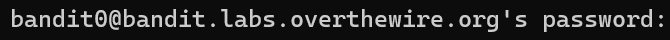

# Bandit Level 0

## Level Goal

The goal of this level is for you to log into the game using SSH. The host to which you need to connect is **bandit.labs.overthewire.org**, on port 2220. The username is **bandit0** and the password is **bandit0**. Once logged in, go to the [Level 1](https://overthewire.org/wargames/bandit/bandit1.html) page to find out how to beat Level 1.

## Connecting to SSH of Bandit0

Firstly,

Username: bandit0

host: bandit.labs.overthewire.org

port: 2220

Syntax

```
ssh [username]@[host] -p [port number]
```

Implementation

```
 ssh bandit0@bandit.labs.overthewire.org -p 2220
```

<figure><figcaption><p>Password prompt for connecting to this SSH</p></figcaption></figure>

Insert the password:

Password: bandit0

Now you have completed Level 0 of Bandit


